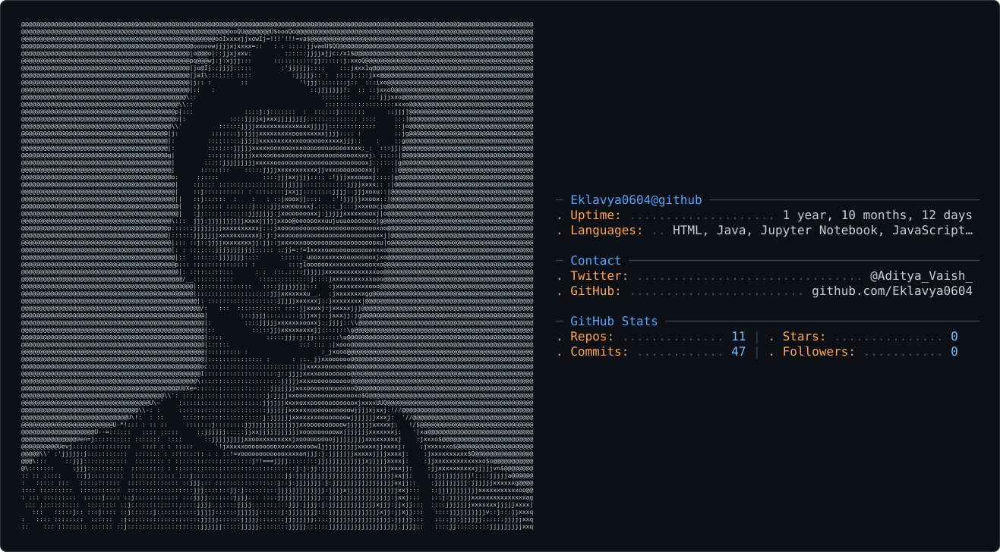

<div align="left">

<picture>
  <source media="(prefers-color-scheme: dark)" srcset="dark_mode.svg" />
  <source media="(prefers-color-scheme: light)" srcset="light_mode.svg" />
  
</picture>

</div>

# 🚀 Hey, I'm Aditya

I'm a Computer Science and Engineering student and aspiring software developer interested in building practical, scalable applications and exploring how modern software systems work.

My primary interests include **Full-Stack Development, Backend Engineering, System Design, AI Engineering, and Software Security**. I enjoy learning by building projects and solving real-world problems.

## 👨‍💻 About Me

```javascript
const developer = {
  name: "Aditya",
  location: "Delhi, India",

  interests: [
    "Full-Stack Development",
    "Backend Engineering",
    "System Design",
    "AI Engineering",
    "Software Security"
  ],

  currentlyLearning: [
    "Advanced System Design",
    "Cloud Technologies",
    "AI & LLM Applications"
  ],

  askMeAbout: [
    "Java",
    "Spring Boot",
    "React",
    "JavaScript",
    "Databases",
    "Backend Development",
    "AI Applications"
  ]
};
```

---

# 🛠️ Tech Stack

## 💻 Programming Languages

<p align="left">
  
  
  
  
  
</p>

## 🎨 Frontend Development

<p align="left">
  
  
  
  
  
  
  
  
  
  
</p>

## ⚙️ Backend Development

<p align="left">
  
  
  
  
</p>

## 🗄️ Databases & Caching

<p align="left">
  
  
  
  
</p>

## 🤖 AI & LLM Engineering

<p align="left">
  
  
  
  
  
</p>

### 🧠 Areas of Interest

- 🧠 Large Language Models (LLMs)
- 🔎 Retrieval-Augmented Generation (RAG)
- 🔗 LangChain
- 🕸️ LangGraph
- 🤖 AI Agents
- 📚 Vector Databases
- ⚡ AI-powered Applications

## 🔧 Tools & Technologies

<p align="left">
  
  
  
  
  
</p>

---

# 🚀 Featured Areas of Work

### 🌐 Full-Stack Development

Building web applications by combining modern frontend technologies with backend APIs and databases.

### 🎨 Interactive Frontend Development

Exploring modern and interactive user experiences using **React, Next.js, GSAP, Three.js, and WebGL**.

### ⚙️ Backend Development

Working with **Java, Spring Boot, JPA, JDBC, REST APIs, Redis, and relational/non-relational databases** to build structured backend applications.

### 🤖 AI Engineering

Exploring **RAG pipelines, LLM applications, LangChain, LangGraph, AI agents, and AI-powered developer tools**.

### 🔐 Software Security

Exploring application security and tools that can help developers identify potential security issues in their code.

---

# 🧠 Problem Solving & LeetCode

I actively practice **Data Structures and Algorithms** and focus on improving my problem-solving and algorithmic thinking.

<p align="left">
  <a href="https://leetcode.com/u/YOUR_LEETCODE_USERNAME/">
    
  </a>

  

  
</p>

<i>Learning patterns, solving problems, and improving one challenge at a time.</i> 🚀

---

# 🎯 Currently Working On

- 🔨 Building and improving full-stack applications
- 🔐 Developing an AI-powered security analysis project
- 🤖 Exploring RAG, LangGraph, and AI agent workflows
- ⚙️ Improving backend development skills with Java and Spring Boot
- 🧠 Learning advanced system design concepts
- ☁️ Exploring cloud technologies and scalable architectures
- 🧩 Practicing Data Structures and Algorithms

---

# 📌 What I'm Interested In

```text
Full-Stack Development
        │
        ├── Frontend Engineering
        │     ├── React & Next.js
        │     ├── GSAP
        │     └── WebGL / Three.js
        │
        ├── Backend Engineering
        │     ├── Java & Spring Boot
        │     ├── REST APIs
        │     └── Databases & Redis
        │
        ├── AI Engineering
        │     ├── RAG
        │     ├── LangChain
        │     ├── LangGraph
        │     └── AI Agents
        │
        └── System Design & Security
```

---

# 🤝 Connect With Me

<p align="left">

  <a href="https://www.linkedin.com/in/aditya-vaish-482a11281/" target="_blank">
    
  </a>

  <a href="https://x.com/Aditya_Vaish_" target="_blank">
    
  </a>

  <a href="https://www.instagram.com/aditya_k.__/" target="_blank">
    
  </a>

</p>

---

<i>Always learning, building, and improving.</i> 🚀